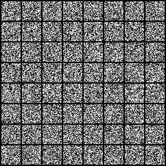

# Diffusion Model for MNIST 

This project is an implementation of a Diffusion Model, specifically designed for the MNIST dataset. The model is trained using PyTorch and the code is organized into several Python scripts.

## Repo Structure

The project is organized into several Python scripts:

- `train.py`: This script is responsible for training the model. It uses the MNIST dataset for training and saves the model weights after each epoch.

- `sample.py`: This script is used to generate samples from the trained model. It also creates an animation of the generated samples.

- `dataset.py`: This script contains the `MnistDataset` class, which is a custom PyTorch Dataset for loading the MNIST dataset.

- `models/blocks.py`: This script contains the `DiffusionModel` class, which is the implementation of the Diffusion Model.

## Animation

The `sample.py` script generates an animation of the samples produced by the model. The animation is saved as a GIF file and can be found at `DiffusionModel/visualization/animation/animation.gif`.



## Reference

This project is based on the tutorial available at [DDPM-Pytorch](https://github.com/explainingai-code/DDPM-Pytorch). The tutorial provides a detailed explanation of the Diffusion Model and how to implement it using PyTorch.

## Usage

To train the model, simply run the `train.py` script. After training, you can generate samples and create an animation by running the `sample.py` script.

## Requirements

- PyTorch
- torchvision
- PIL
- tqdm
- numpy
- imageio

Please ensure that these libraries are installed before running the scripts.

PS: The repo is still under development. Readme generated by co-pilot
```