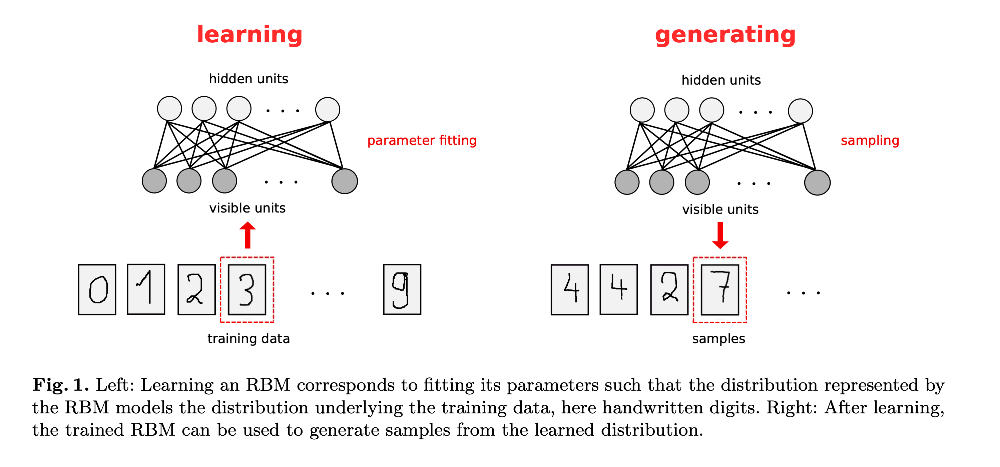

## Restricted Boltzmann Machines (RBMs)
Implementation of Restricted Boltzmann Machine (RBM) with Gibbs Sampling.

RBM is one of the first generative model that can be used for dimensionality reduction, classification, regression, collaborative filtering, feature learning and generation.

The basic idea behind RBMs is to model the joint probability distribution of the visible and hidden units.

Image reference: https://christian-igel.github.io/paper/TRBMAI.pdf

### Energy Function (E)

The energy of an RBM is defined as:

Where:
- \(E(v, h)\) is the energy of the RBM given visible units \(v\) and hidden units \(h\).
- \(W\) is the weight matrix connecting visible and hidden units.
- \(b\) is the bias vector for the visible units.
- \(c\) is the bias vector for the hidden units.

### Joint Probability (P)

The joint probability of the visible and hidden units is given by the Boltzmann distribution:

Where \(Z\) is the partition function, a normalization constant that ensures the probabilities sum to 1.

### Conditional Probabilities

The conditional probability of the hidden units given the visible units is given by:

The conditional probability of the visible units given the hidden units is given by:

### Gradients for Training

For gradient calculation refer: https://christian-igel.github.io/paper/TRBMAI.pdf

